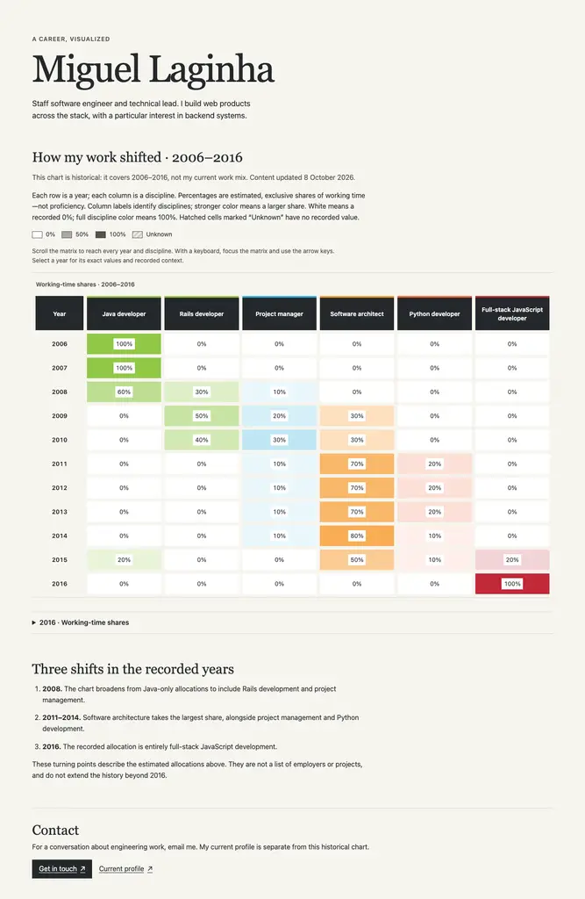

# Resume visualized

A visual résumé that maps years against work disciplines. Color intensity shows **estimated, exclusive shares of working time—not proficiency**. Miguel Laginha's current introduction and contact are separate from the historical **2006–2016** chart.

Created by Miguel Laginha, inspired by David McCandless's [The beauty of data visualization](https://informationisbeautiful.net/2010/the-beauty-of-data-visualization/).



[Phone and selected-year detail reference](images/mobile.webp).

## Development

The application is a static Vite + vanilla TypeScript site, with a semantic HTML/CSS matrix and no runtime dependencies or CDN scripts. Use **Node 24.21.0** and **npm 12.2.0**, pinned in `.nvmrc` and `package.json`.

With [nvm](https://github.com/nvm-sh/nvm) installed, run from the repository root:

```sh
nvm install
nvm use
npm install --global npm@12.2.0
npm ci
npm run dev
```

Open the local URL printed by Vite. The npm version must be selected separately from Node's bundled npm. With another version manager, select the same Node version; `npm exec --yes --package npm@12.2.0 -- npm ci` also runs the pinned npm without changing the global installation.

```sh
npm run typecheck
npm test
npm run build
npm run preview
```

`build` writes `dist/`; `preview` serves that production output. Relative assets support the `/resume-visualized/` project base. Do not publish source files or commit generated output.

## Publishing

Live URL: **https://miguellaginha.com/resume-visualized/**, the inherited domain returned by GitHub Pages and owner-approved. The root profile site and DNS are unchanged.

The existing `.github/workflows/ci.yml` installs the pinned toolchain and runs `npm ci`, typecheck, the regression, and **one production build**. Only a non-PR `master` run uploads that exact `dist/` artifact. The dependent `github-pages` job has scoped Pages/OIDC permissions; PRs do not deploy. Pages uses GitHub Actions with HTTPS enforced and its environment restricted to the `master` branch. [Launch CI and deployment](https://github.com/brecke/resume-visualized/actions/runs/37907196520) passed. Manual workflow dispatch can redeploy `master` using the same checks/build.

To publish a data update:

1. Obtain owner-approved facts; edit `app/career.json`. Align historical coverage, narrative, metadata and noscript copy in `app/index.html`, and manually update the content-review date.
2. Run the development/check/build/preview commands above. Inspect phone/keyboard behavior and print to PDF; keep all rows, columns, legend, coverage and contact readable.
3. Refresh `app/public/social-preview.png` when facts or visible copy change: render the **actual matrix**, owner name and short estimated-share/date description into a **1200 × 630 PNG**, retaining all six disciplines and eleven recorded years. Do not redraw invented values. Update owned desktop/phone references when screen appearance changes. This is a manual asset refresh, not an automatic export feature.
4. Open a feature PR to `master`, review its CI results, and merge after approval. Observe the Pages job, then check the real HTTPS URL, asset/404 routes, phone/keyboard, PDF, and actual hosted link preview. A successful local build is not proof of publication.

## Sharing and print

Static canonical, Open Graph and large-image card metadata are in `app/index.html`; the [social PNG](app/public/social-preview.png), original SVG favicon, recovery page and deployed notices live in `app/public/`. All are copied by Vite. The 404 recovery link uses the absolute project home so deep missing paths can recover. Browser-native sharing/address-bar copying supplies the share route; there is no custom clipboard/share widget.

Use the browser's Print command. Native print CSS removes sticky/nested scrolling and focus outlines, keeps the complete matrix and legend, and prints contact/profile destinations. The verified Chromium **A4 landscape, background graphics enabled** PDF fits intro, 66 values, coverage/update date and contacts on one page. Other printer settings can paginate differently. This does not promise a downloadable résumé or automatic image export.

## Career data

Edit **`app/career.json`**, the single source of career facts:

- `coverage` declares inclusive `startYear` and `endYear`; the supplied history is **2006–2016**. The current date never extends it.
- `disciplines` declares stable IDs, display names, and six-digit hex base colors in column order.
- `years` contains explicitly dated records with a `complete` flag and one allocation per discipline ID.
- Numeric values are finite percentages in **0–100**. A recorded `0` means no time allocated; `null` means unknown, not zero.
- Complete years have no unknown values and total **100%**. Incomplete years may contain unknown values or partial totals, but their known shares cannot exceed 100%. Validation allows a small floating-point tolerance when comparing totals.
- Every year in declared coverage needs a record. Represent a wholly unknown year explicitly as incomplete with null allocations; do not silently skip gaps or invent zeros.

The owner confirmed that these are **estimates** of exclusive working-time shares and corrected **2015 Software architect from 70% to 50%** (20 percentage points), retaining the other allocations. Its total is now 100%. No other numeric career values were changed. Owner-approved display names are Java developer, Rails developer, Project manager, Software architect, Python developer, and Full-stack JavaScript developer; preserve stable IDs when editing labels.

`app/scripts/data.ts` validates imported data before rendering. `app/scripts/test/data.test.ts` uses Node's built-in test runner to cover totals, coverage, missing data, malformed records, and percentage boundaries. Update facts only from owner-supplied information, then run the checks above.

The renderer in `app/scripts/main.ts` provides a caption, linked row/column headers, and exact values as text. Native CSS maps 0% to white and 100% to the discipline's base color. Unknown cells are labelled and hatched; incomplete years are marked partial. The editorial layout uses one quiet theme, system serif/sans typography, and small CSS tokens; the original matrix and palette remain the centerpiece.

On narrow screens, focus the signposted matrix region and use arrow keys to reach every year and discipline, or scroll by touch. Year labels and column headers remain sticky inside the region; native scroll padding keeps backward keyboard focus clear of the headers. Desktop uses the matrix's full content height rather than a nested vertical scroll cap.

Tab to a year and press Enter/Space, or tap it, to open its exact six values and recorded completeness/coverage context. Activation focuses the native detail summary; Enter/Space on that summary closes it. Fine-pointer hover shows the same information without stealing focus. Only years are buttons—not every cell—and the table remains readable without opening details. Introduction, metric explanation, historical narrative, update date and email/profile routes remain readable with JavaScript disabled; the matrix itself needs JavaScript. No animation is introduced.

## Biography and copy

Edit **`app/index.html`** for the current introduction, chart instructions, historical turning points, contact/profile routes, and fixed `<time>` content-update date. Selected-year metric context is in `app/scripts/main.ts`. Keep historical coverage and the noscript message aligned with `career.json`; a current biography does not create newer allocations.

The introduction and contact were taken from Miguel's [published current profile](https://miguellaginha.com/) and explicitly owner-approved. The primary route is `mailto:me@miguellaginha.com`; the secondary link is a real current profile, not a résumé PDF. The three turning points describe only existing records: diversification in 2008, architecture's largest share in 2011–2014, and the full-stack JavaScript allocation in 2016. They do not invent employers, projects, outcomes, or later work.

**Content updated: 8 October 2026.** This is the fixed date of the approved content update, not the end of the chart or a build/deployment timestamp. Update it manually when content is reviewed or edited; never regenerate it on every build. Review new biography/contact/label claims with the owner. Run the checks, inspect production copy and interactions, then intentionally refresh `images/desktop.webp` and `images/mobile.webp` when visible content changes.

## Revamp tracking

- [GitHub epic #1](https://github.com/brecke/resume-visualized/issues/1): canonical task tracking and release criteria.
- [Foundation #2](https://github.com/brecke/resume-visualized/issues/2): the implemented data/tooling/renderer cutover; publication status remains in the issue.
- [Design #3](https://github.com/brecke/resume-visualized/issues/3): editorial layout, accessible responsive matrix, native year details, and reference screenshots.
- [Copy #4](https://github.com/brecke/resume-visualized/issues/4): approved current biography/contact, estimated metric, honest dates, standardized labels, and record-backed turning points.
- [Release #5](https://github.com/brecke/resume-visualized/issues/5): HTTPS Pages deployment, real fetched social cards, print and accessibility evidence.
- [ROADMAP.md](ROADMAP.md): historical assessment, direction, and links to design, copy, and release work.
- [AGENTS.md](AGENTS.md): repository map and AI-assisted contribution rules.

Foundation, responsive design, approved copy and the share-ready site are published through sequential merge-commit PRs. GitHub issues hold the canonical acceptance and publication evidence; optional #6 work is not a release dependency.

## Verification and attribution

The foundation passed clean-checkout installation, type checking, the deterministic regression, and production build on the pinned runtime, including its simulated 2040 clock check. The design change passed the same typecheck/regression/build gate and real production browser smoke at **390 × 844**, **1366 × 900**, and **1920 × 1080**. All 66 recorded values and 41 zero/full-color endpoints were preserved. Native touchscreen input, forward/backward Tab navigation, arrow-key scrolling, hover, disclosure, state-preserving resize, script-disabled contact, and temporary unknown/partial data were exercised. A backward-focus occlusion was reproduced and fixed with native scroll padding.

Computed text contrast was at least **7.32:1** across 107 inspected text elements; an achromatopsia simulation retained readable labels and exact values. The actual Chromium accessibility tree exposed the headings, captioned table, seven column headers, eleven row headers, 66 cells, and eleven year buttons. This checks semantic reading order, not an auditory VoiceOver/NVDA session or a WCAG certification. **200% layout zoom was emulated** using half the laptop's CSS viewport and double device scale, with scrolling and year details still usable.

The design/copy production HTML/CSS/JS loaded at `/resume-visualized/` without CDN requests or observed application runtime errors. The previously undeclared favicon request is now replaced by a local explicit SVG favicon. Headed touch automation timed out in the design phase; trusted touch succeeded in isolated headless Chromium. Remote CI/deployment evidence is tracked separately from these local checks.

The copy change passed typecheck, the existing regression, and production build. Actual **1366 × 900** desktop and **390 × 844** phone checks preserved all 66 allocations and 41 color endpoints, exercised keyboard/touch year details and contact discovery, and loaded the real current-profile destination. A simulated 2040 browser clock left coverage at 2006–2016 and the content-update date at 2026-10-08. Script-disabled copy/contact and actual subpath HTML/CSS/JS passed; no application runtime errors were observed. Computed text contrast remained at least 7.32:1 across 113 inspected elements. This was structured content/interaction verification, not an independent human usability study. The mailto URI matches the owner-published address; no email was sent or inbox delivery tested.

Local release smoke preserved all numeric facts and checked static metadata with JavaScript disabled, image/favicon/notices/recovery assets, literal project-subpath loading, one-page PDF extraction/visual layout, touch/details, full keyboard scrolling, 320px reflow and requested text-spacing overrides. A throttled phone viewport (150ms latency, 62.5kB/s download, 4× CPU, cold cache) had observed CLS **0**, FCP about **0.47s** and LCP about **0.48s** across the local samples; these are not public-network benchmarks.

Public release checks on **9 October 2026** verified HTTPS, static/script-disabled metadata, same-origin assets, favicon/notices, actual HTTP 404 and home recovery, all 66 values/41 color endpoints, trusted phone touch and keyboard, the current-profile destination and a one-page full-matrix PDF. [MetaTags.io fetched the real public URL](https://metatags.io/?url=https%3A%2F%2Fmiguellaginha.com%2Fresume-visualized%2F); its actual X/Facebook/LinkedIn/Slack preview cards used the 1200×630 PNG, with owner name, historical description and full matrix visible. This was a hosted inspector, not a message posted to those services. A cold-cache 390px public page under 150ms latency, 62.5kB/s download and 4× CPU had observed CLS **0**, FCP/LCP **0.552s**, no page overflow, and only own-origin application resources. These are individual emulated-browser samples, not field benchmarks.

### Accessibility audit scope

Applicable [WCAG 2.2 A/AA](https://www.w3.org/WAI/WCAG22/quickref/) essentials were inspected:

| Criteria | Exercised evidence |
| --- | --- |
| 1.1.1, 1.3.1–2, 1.4.1 | Exact text values, named rows/columns, linked header IDs; actual AX tree exposes 7 column headers, 11 row headers and 66 cells. Color is not the sole encoding. |
| 1.4.3, 1.4.11 | Computed text contrast ≥7.32:1 across 113 elements; 3px visible keyboard focus and selected state. Heatmap color is redundant to exact text. |
| 1.4.4, 1.4.10, 1.4.12 | 320px page reflow without overflow; 200% layout emulation; prescribed spacing overrides without clipped text. The two-dimensional table has signposted internal scrolling. |
| 1.4.13, 2.1.1–2, 2.4.3/7/11 | Native normal-flow disclosure, keyboard/touch equivalents, close behavior, forward/backward year order, last-column arrow access, non-occluded focus and no per-cell tab stops. |
| 2.4.2/4/6, 3.1.1 | Meaningful static titles, English page language, headings, email/profile purpose and labelled recovery route. |
| 2.5.1–3/8, 3.2.1–2, 4.1.2 | Native click/tap controls with matching visible names, ≥44px year/link targets, no navigation on focus, observed button/disclosure/link roles and expanded state. |

There is no timed/media/animated content, form entry/authentication, dragging/motion input or repeated navigation block. This is a manual applicable-criterion audit, not an independent conformance certification. Phone/touch and 200% layouts are emulated Chromium surfaces; AX inspection is structural, not an auditory VoiceOver/NVDA session or physical-device test.

The owner confirmed **[MIT](LICENSE)** for the repository. The original author notice is retained in `app/scripts/main.ts`; owner and emitted Vite/Rolldown grants are also shipped in [deployed notices](app/public/THIRD-PARTY-NOTICES.txt). Pinned build tools include MIT and Apache-2.0 licenses and retain their own distribution notices; this is not a legal audit of every bundled tool dependency. No third-party font/image/runtime package is served. Palette/inspiration and retired-gradient attribution remain in the source/notices; those references are not a grant over third-party websites/artwork. Replace the personal identity/contact/history before publishing a fork as your own.
